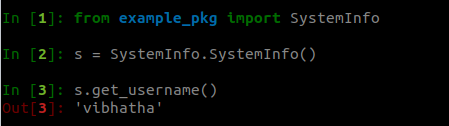

# pip-packaging

Example Pip Package Tutorial [Following Standard Pip Docs]

This sample package was created following the Pip Package Tutorial 

[Pip Package Tutorial](https://packaging.python.org/tutorials/packaging-projects/)

